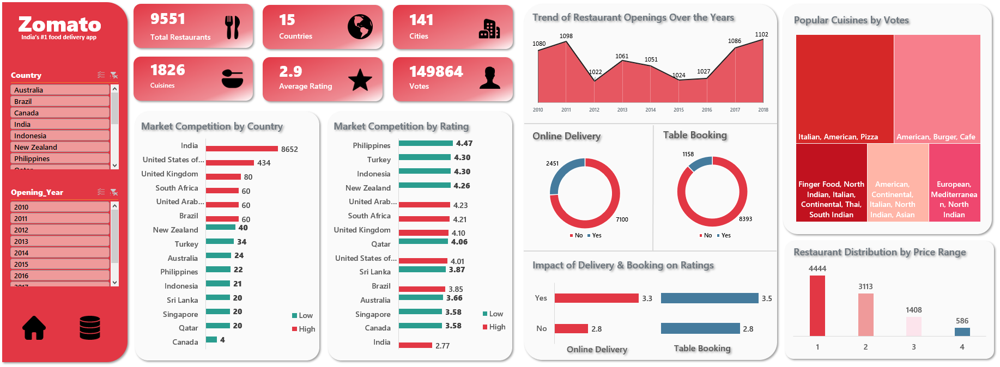

**🍽️ Zomato Restaurant Data Analysis**

Exploring market competition, pricing trends, customer preferences, and service impacts using spreadsheet analytics.

**📌 Project Overview**

This project analyzes restaurant data from 15 countries using Excel to uncover insights about market competition, pricing, service models (like delivery and booking), and customer preferences.

**📊 Tools Used**

--Microsoft Excel

--Data Visualizations (Pivot Charts, Slicers, Conditional Formatting)

--Basic Formulas & Lookup Functions

--Interactive Dashboards with Filters

**🔍 Key Insights**

**Steady Growth:** A consistent increase in restaurant openings with a sharp spike post-2016, indicating a booming global food market.

**Market Competition:** India leads with the highest number of restaurants, signaling a highly saturated market, whereas countries like Canada and Qatar have lower competition.

**Customer Preference:** Cuisines like Italian, American, and Pizza dominate votes globally.

**Service Influence:** Restaurants offering delivery and table booking consistently receive higher ratings.

**Pricing Patterns:** Most restaurants fall in the lower price ranges (1 & 2), showing pricing accessibility.

🖥️ **Dashboard Highlights**

--Market Competition Column Chart

--Year-wise Restaurant Openings Chart

--Restaurant Openings Trend Chart

--Cuisine Popularity Tree Map

--Impact of Delivery & Booking on Ratings

--Price Range Distribution Column Chart

--Interactive Filters: Country & Year slicers

--Custom Navigation: Home → Pivot Tables | Data → Raw Data

**Repository Structure**

📁Restaurant-Analysis-Project|--📜 Dashboard Screenshot.png |--📜 Zomato_Restaurant_Analysis (CSV/Excel) |--📜 Zomato_Restaurant_Analysis (PPTX) |--📜 README.md
